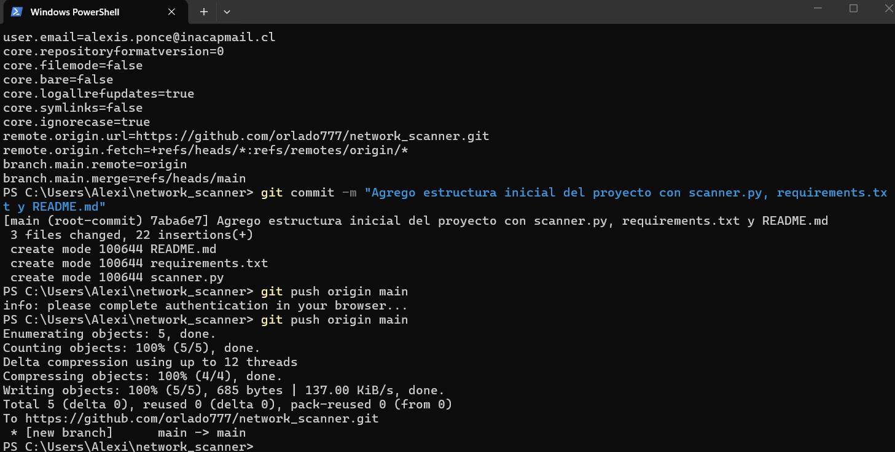
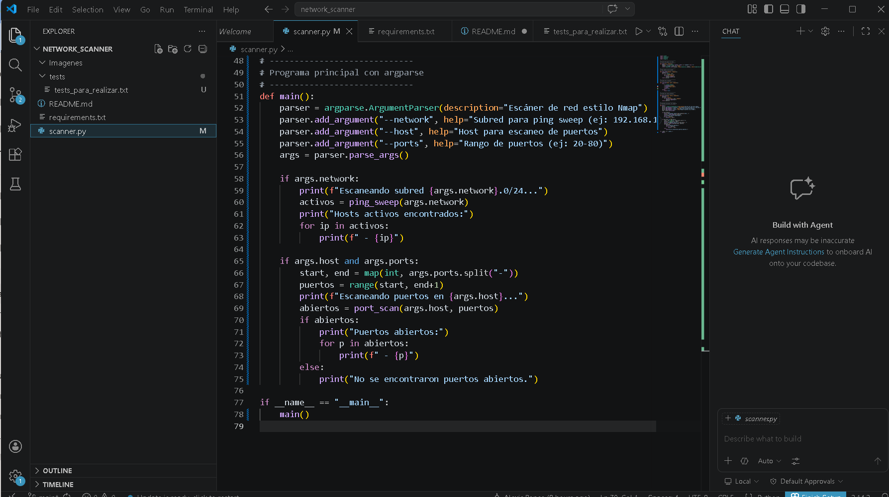
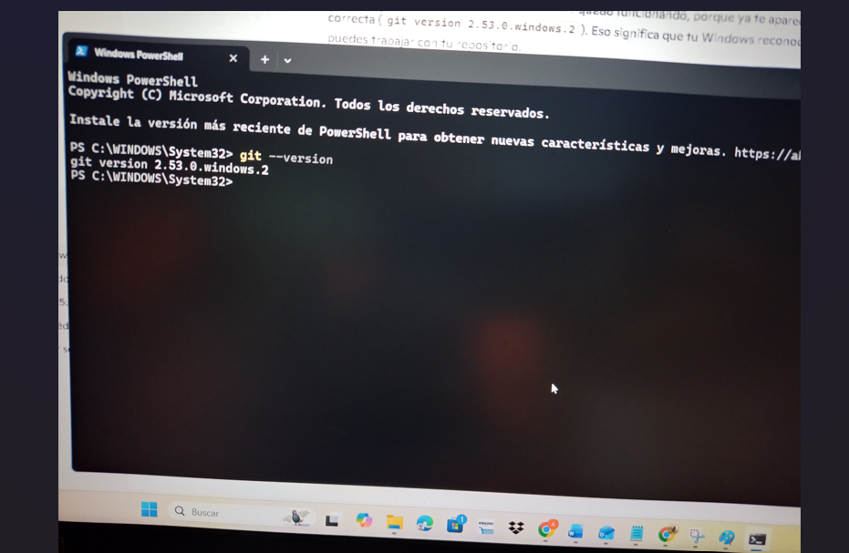
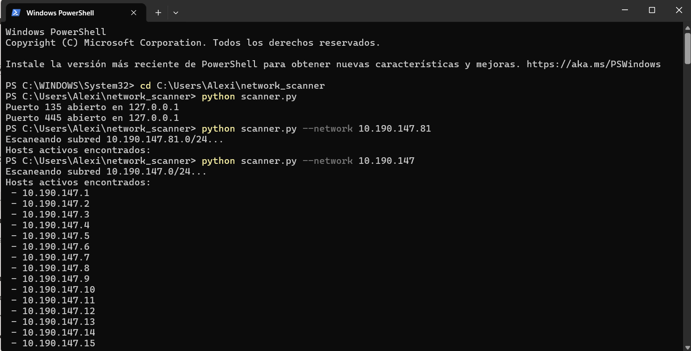
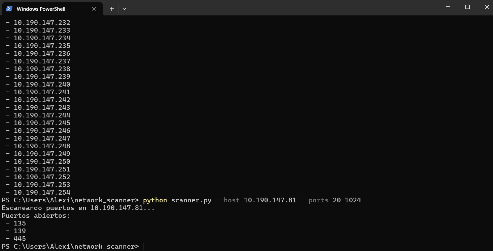

# Network Scanner

## Asignatura
Redes Avanzadas - INACAP

## Descripción
Este proyecto consiste en la construcción de un escáner de red en Python.  
Permite identificar hosts activos en una subred y detectar puertos abiertos en un host específico, incluyendo la opción de realizar banner grabbing para reconocer servicios básicos.

## Objetivos
- Detectar hosts activos mediante ping sweep.
- Escanear puertos en un host específico.
- Identificar servicios básicos mediante banner grabbing.
- Trabajar en equipo utilizando Git/GitHub para control de versiones.
- Documentar el proyecto con ejemplos y capturas.

## Estructura del Proyecto
scanner.py        # Código principal  
requirements.txt  # Dependencias del proyecto  
README.md         # Documentación  
/tests            # Pruebas unitarias  
/images           # Capturas de ejecución (pantallazos)  

## Requisitos
- Python 3.8 o superior  
- Sistema operativo: Windows / Linux  
- Librerías estándar de Python (socket, argparse, subprocess)  

Instalación de dependencias:  
pip install -r requirements.txt

Código

## Uso del Script

### 1. Ping Sweep (escaneo de hosts activos)
python scanner.py --network 10.190.147

Código

### 2. Escaneo de Puertos
python scanner.py --host 127.0.0.1 --ports 20-1024

Código

### 3. Ayuda automática
python scanner.py --help

Código

## Capturas

### Estructura inicial

### VS Code

### Git instalado

### Ping Sweep

### Port Scan

## Estado del Proyecto
- Fase 1: Organización del equipo y repositorio (completada)  
- Fase 2: Diseño del escáner (completada)  
- Fase 3: Implementación básica (completada: ping sweep, port scan, argparse, banner grabbing)  
- Fase 4: Mejoras (pendiente: multithreading, guardar resultados, GUI con Tkinter)  
- Fase 5: Pruebas y documentación con capturas (pendiente)  

## Integrantes del Equipo
- **Líder del proyecto:** Orlando Araya  
- **Desarrollador principal:** Alexis Ponce  
- **Documentador:** Rogger Rojas  

## Notas
- `.gitignore` configurado para ignorar archivos innecesarios (`__pycache__`, `.venv`, etc.).  
- Se recomienda probar el script en diferentes redes para validar resultados.  
- Próximas mejoras: multithreading para acelerar escaneo, exportar resultados 